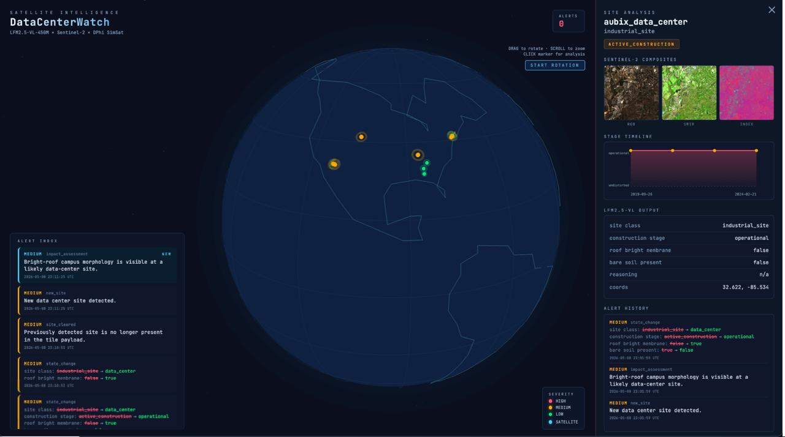

# HyperScalerCenterWatch

Satellite monitoring for data-center and industrial-site detection using Sentinel-2 composites, SimSat, Gemini/LFM inference, a packet downlink pipeline, and a live React dashboard.



The U.S. is building data centers faster than it can keep track of them. Pew counts 3,000+ operational and 1,500+ in development as of Feb 2026, with construction starts in early 2026 running ~26× year-over-year. 67% of planned facilities are heading to rural counties and 39% to counties that have never hosted one before. These projects routinely arrive under shell-LLC codenames ("Project Tango," "Project Flex," Meta's "Redale LLC"); the University of Michigan found in 2025 that operators "often have binding non-disclosure agreements with local government" and that the industry lobbies against basic disclosure on water and power. Residents typically learn what's been built next to them only after the noise, traffic, or air-quality complaints start. For instance, xAI's Colossus-1 ran 35 unpermitted gas turbines in South Memphis before aerial flyovers exposed it.

HyperscalerWatch closes that information asymmetry. Our fine-tuned LFM2-VL-450M runs on-orbit over Sentinel-2 and Mapbox images and emits alerts on each pass which are analyzed further on the ground: what's being built, its construction stage, how it impacts water and vegetation around. This can then be used by governments, zoning boards or researchers to act on.

The unlock is threefold: every new build becomes detectable the moment ground is broken (making rogue and codenamed campuses hard to hide), the cumulative network footprint becomes legible (Pew finds 90% of data centers cluster within five miles of another, and effects on grid, water, and air don't sum linearly), and the next hundred gigawatts of capacity can be planned against an honest track record of past impacts. Data centers and hyperscale AI are necessary infrastructure. This is how we build them responsibly.

## What It Does

HyperscalerrWatch has four moving parts:

1. `SimSat/` simulates the satellite and serves imagery on `http://localhost:9005`.
2. `scripts/satellite.py` fetches tiles, runs the vision model, and writes downlink packets to `downlink_packets.jsonl`.
3. `scripts/ground.py` ingests those packets into `ground.db`.
4. The dashboard stack shows the results:
   - FastAPI backend: `app/api.py` on `http://localhost:8001`
   - React frontend: `dashboard/` on `http://localhost:5173`


## Prerequisites

Install these first:

- Python 3.11+
- `uv`
- Node.js 20+
- Docker Desktop

## Environment Files

There are two environment files involved.

### 1. Root `.env`

Place this file at:

```text
datacenter_watch/.env
```

This is used by the Python code in this repo, including `app/api.py` and the Gemini annotator.

Put in:

```env
GEMINI_API_KEY=your_google_ai_api_key
```


### 2. SimSat `.env`

Place this file at:

```text
datacenter_watch/SimSat/.env
```

This is read by `SimSat/docker-compose.yaml`.

Put in:

```env
MAPBOX_ACCESS_TOKEN=your_mapbox_token
```

Mapbox is optional for some flows, but the SimSat stack expects this when serving Mapbox imagery.

## Install

From the repo root:

```bash
uv sync
cd dashboard
npm install
cd ..
```

## Run The Full Stack

Use five terminals from the repo root unless noted otherwise.

### Step 1: Start SimSat

```bash
cd SimSat
docker compose up --build
```

What you get:

- SimSat dashboard: `http://localhost:8000`
- SimSat imagery API: `http://localhost:9005`

After it starts, open `http://localhost:8000` and press the start button in the SimSat UI so the simulation leaves the zero-state.

### Step 2: Start The Dashboard API

From the repo root:

```bash
uv run uvicorn app.api:app --reload --port 8001
```

This serves `/api/state`, `/api/sites/:id`, and image routes for the React UI.

### Step 3: Start The React Frontend

From the repo root:

```bash
cd dashboard
npm run dev
```

Open:

```text
http://localhost:5173
```

The Vite dev server proxies `/api` requests to `http://localhost:8001`.

### Step 4: Start Satellite Inference

From the repo root:

```bash
uv run scripts/satellite.py \
    --dataset-dir <data/test> \
    --backend local \
    --model lfm2.5-vl-Q8_0.gguf \
    --mmproj mmproj-lfm2.5-vl-Q8_0.gguf \
    --downlink downlink_packets.jsonl

```

This continuously cycles through the watchlist, fetches imagery from SimSat, runs inference, and appends changes to `downlink_packets.jsonl`.

### Step 5: Start Ground Ingest

From the repo root:

```bash
 uv run scripts/ground.py \
    --downlink downlink_packets.jsonl \
    --db ground.db \
    --follow \
    --interval-seconds 30
```

This watches `downlink_packets.jsonl` and continuously updates `ground.db`.


### Satellite Running Modes: Watchlist Loop

```bash
uv run scripts/satellite.py --backend gemini --watchlist-loop --interval-seconds 30 --downlink downlink_packets.jsonl
```

### Single Watchlist Location

```bash
uv run scripts/satellite.py --backend gemini --watchlist-loop --watchlist-location aubix_data_center --interval-seconds 30 --downlink downlink_packets.jsonl
```

### Current Satellite Position Loop

```bash
uv run scripts/satellite.py --backend gemini --current-loop --interval-seconds 30 --downlink downlink_packets.jsonl
```

### One-Off Live Tile At A Specific Location And Time

```bash
uv run scripts/satellite.py --backend gemini --location aubix_data_center --timestamp 2026-05-08T23:00:00Z --downlink downlink_packets.jsonl
```

### Replay A Saved Dataset

```bash
uv run scripts/satellite.py --backend gemini --dataset-dir data/datacenter_watch --downlink downlink_packets.jsonl
```

## Notes

- `scripts/satellite.py` requires exactly one execution mode: `--watchlist-loop`, `--current-loop`, `--location`, `--sample-dir`, or `--dataset-dir`.
- If SimSat has not started yet, live modes will fail because the current position is still the zero-state.
- `scripts/ground.py --follow` should run against the same downlink file that `scripts/satellite.py` is writing.
- The React dashboard uses the ingested SQLite state, not the raw JSONL file directly.
- The legacy Streamlit dashboard still exists at `app/app.py`, but the screenshot in this README is the React dashboard in `dashboard/`.
